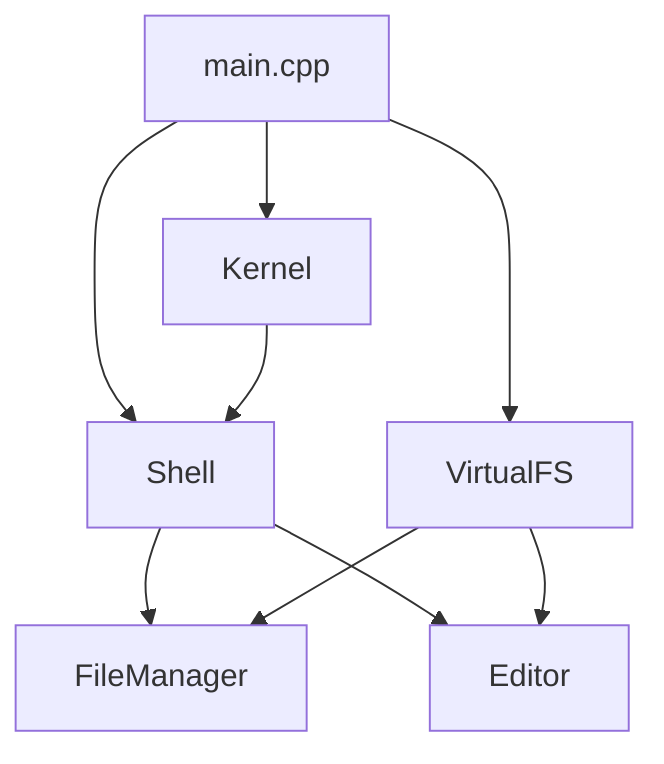

---
tags:
  - project
  - cpp
  - os
  - git
  - quick
type: project-spec
priority: high
deadline: 2026-04-04
team-size: 2
cssclasses:
  - git-quick
---

# Проект: Mini UNIX-like OS на C++

> **Цель:** Создать простейшую UNIX-подобную систему за 2-3 дня для изучения Git и командной разработки.

## 🎯 Основные требования

1. **Работоспособность** — программа запускается в терминале Linux/macOS/WSL
2. **Модульность** — каждый компонент независим
3. **Git-процесс** — все изменения через Pull Requests
4. **Документация** — каждый модуль имеет README

## 🏗 Архитектура системы



📦 Модули и распределение задач

Sprint 1: Базовое ядро (День 1)

Module 1: VirtualFS (👤 Developer A)

```cpp
// vfs.h
class VirtualFS {
    struct INode {
        std::string name;
        std::string content;
        bool isDirectory;
        std::vector<INode*> children;
        INode* parent;
        time_t created;
        time_t modified;
        mode_t permissions; // 0755, 0644
    };
    
    INode* root;
    INode* cwd; // current working directory
    std::unordered_map<std::string, INode*> pathCache;
    
public:
    VirtualFS();
    ~VirtualFS();
    
    // Основные операции (CRUD)
    bool createFile(const std::string& path, const std::string& content = "");
    bool createDirectory(const std::string& path);
    std::string readFile(const std::string& path);
    bool writeFile(const std::string& path, const std::string& content);
    bool remove(const std::string& path);
    
    // Навигация
    bool changeDirectory(const std::string& path);
    std::vector<FileInfo> listDirectory(const std::string& path = "");
    std::string getCurrentPath() const;
    
    // Дополнительно
    bool copy(const std::string& src, const std::string& dst);
    bool move(const std::string& src, const std::string& dst);
    bool exists(const std::string& path);
    FileInfo stat(const std::string& path);
    
private:
    INode* resolvePath(const std::string& path);
    void normalizePath(std::string& path);
    void updatePathCache(INode* node);
};
```

Задачи:

· Реализовать структуру INode
· Создать root и базовые директории (/home, /bin, /etc, /tmp)
· Реализовать resolvePath (разбор путей типа ../, ., /)
· CRUD операции для файлов
· Работа с директориями
· Копирование и перемещение

Тесты:

```cpp
// test_vfs.cpp
void testVirtualFS() {
    VirtualFS fs;
    assert(fs.createDirectory("/home/user"));
    assert(fs.createFile("/home/user/test.txt", "Hello"));
    assert(fs.readFile("/home/user/test.txt") == "Hello");
    assert(fs.listDirectory("/home").size() == 1);
}
```

---

Module 2: Shell (👤 Developer B)

```cpp
// shell.h
class Shell {
    VirtualFS* fs;
    Kernel* kernel;
    std::vector<std::string> history;
    std::string prompt;
    bool running;
    
    struct Command {
        std::string name;
        std::vector<std::string> args;
        bool background;
        std::string inputRedirect;
        std::string outputRedirect;
    };
    
public:
    Shell(VirtualFS* fs, Kernel* kernel);
    void run();
    
private:
    std::string readLine();
    Command parseCommand(const std::string& line);
    void executeCommand(const Command& cmd);
    void executeBuiltin(const Command& cmd);
    
    // Встроенные команды
    void cmd_ls(const std::vector<std::string>& args);
    void cmd_cd(const std::vector<std::string>& args);
    void cmd_pwd();
    void cmd_mkdir(const std::vector<std::string>& args);
    void cmd_touch(const std::vector<std::string>& args);
    void cmd_cat(const std::vector<std::string>& args);
    void cmd_echo(const std::vector<std::string>& args);
    void cmd_rm(const std::vector<std::string>& args);
    void cmd_mv(const std::vector<std::string>& args);
    void cmd_cp(const std::vector<std::string>& args);
    void cmd_history();
    void cmd_clear();
    void cmd_fm();   // запуск файлового менеджера
    void cmd_edit(const std::vector<std::string>& args);
    void cmd_ps();   // список процессов
    void cmd_kill(const std::vector<std::string>& args);
    void cmd_help();
    void cmd_exit();
};
```

Задачи:

· Цикл read-eval-print
· Парсер команд (поддержка кавычек и экранирования)
· Все builtin команды
· История команд (стрелка вверх/вниз)
· Автодополнение по Tab (базовое)
· Подсветка синтаксиса (опционально)

Тесты:

```cpp
void testShell() {
    VirtualFS fs;
    Kernel k;
    Shell sh(&fs, &k);
    
    Command cmd = sh.parseCommand("ls -la /home");
    assert(cmd.name == "ls");
    assert(cmd.args[0] == "-la");
    assert(cmd.args[1] == "/home");
}
```

---

Sprint 2: Пользовательский интерфейс (День 2)

Module 3: FileManager (👤 Developer A)

```cpp
// filemanager.h
class FileManager {
    VirtualFS* fs;
    struct Panel {
        std::string path;
        std::vector<FileInfo> items;
        int selected;
        int scrollOffset;
        bool active;
    };
    
    Panel leftPanel;
    Panel rightPanel;
    bool running;
    
public:
    FileManager(VirtualFS* fs);
    void run();
    
private:
    void render();           // отрисовка интерфейса
    void handleInput();      // обработка клавиш
    void refreshPanel(Panel& panel);
    void copyCurrentToOther();
    void moveCurrentToOther();
    void deleteCurrent();
    void viewFile(const std::string& path);
    void editFile(const std::string& path);
    
    // Вспомогательные
    std::string formatSize(size_t bytes);
    std::string formatTime(time_t t);
    void drawStatusBar();
    void drawFunctionKeys();
};
```

Клавиши управления:

Клавиша Действие
Tab Переключить активную панель
↑/↓ Навигация по списку
Enter Войти в директорию / открыть файл
F3 Просмотр файла
F4 Редактировать файл
F5 Копировать в другую панель
F6 Переместить в другую панель
F7 Создать директорию
F8 Удалить
F10 Выход

Задачи:

· Две панели с синхронизацией
· Навигация по директориям
· Копирование/перемещение между панелями
· Создание/удаление файлов и директорий
· Просмотр файлов (read-only)
· Интеграция с редактором

---

Module 4: Editor (👤 Developer B)

```cpp
// editor.h
class Editor {
    VirtualFS* fs;
    std::string filename;
    std::vector<std::string> lines;
    
    struct Cursor {
        int row;      // строка (0-based)
        int col;      // колонка (0-based)
        int renderX;  // с учетом табуляции
    } cursor;
    
    int scrollOffset;
    bool modified;
    bool running;
    
public:
    Editor(VirtualFS* fs);
    void open(const std::string& file);
    void run();
    
private:
    void render();           // отрисовка с номерами строк
    void handleInput();      // обработка клавиш
    
    // Редактирование
    void insertChar(char c);
    void deleteChar();
    void newLine();
    void backspace();
    
    // Навигация
    void moveCursor(int dx, int dy);
    void moveToStartOfLine();
    void moveToEndOfLine();
    void movePageUp();
    void movePageDown();
    
    // Работа с файлом
    void save();
    void load();
    bool confirmSave();
    
    // Поиск
    void search();
    void findNext();
    
    // Вспомогательные
    void updateRenderX();
    int getRenderX(int col);
    void drawStatusBar();
    void drawMessage(const std::string& msg);
};
```

Клавиши редактора:

Клавиша Действие
↑/↓/←/→ Перемещение курсора
Home/End Начало/конец строки
PageUp/Down Страница вверх/вниз
Backspace Удалить символ слева
Delete Удалить символ справа
Enter Новая строка
Ctrl+S Сохранить
Ctrl+X Выйти (с подтверждением)
Ctrl+F Поиск
Ctrl+G Найти следующий

Задачи:

· Загрузка и отображение файла
· Редактирование (вставка/удаление)
· Сохранение файла
· Навигация по тексту
· Поиск строки
· Подсветка синтаксиса (опционально)
· Отображение номеров строк

---

Sprint 3: Интеграция и полировка (День 3)

Module 5: Kernel и IPC (👤 Developer A + B)

```cpp
// kernel.h
struct Process {
    int pid;
    std::string name;
    enum State { READY, RUNNING, BLOCKED, TERMINATED } state;
    void* context;
    std::unique_ptr<Process> next;
};

class Kernel {
    VirtualFS* fs;
    std::unordered_map<int, Process> processes;
    int nextPid;
    Process* currentProcess;
    
public:
    Kernel(VirtualFS* fs);
    void init();
    
    // Управление процессами
    int spawn(const std::string& program, const std::vector<std::string>& args);
    void kill(int pid);
    void ps();
    void yield();  // переключение контекста
    
    // IPC (межпроцессное взаимодействие)
    void pipe(int pipefd[2]);
    void send(int pid, const std::string& message);
    std::string receive(int pid);
    
private:
    void scheduler();  // простейший round-robin
};
```

Задачи:

· Система процессов (поточность внутри одного приложения)
· Простой планировщик
· Межпроцессное взаимодействие (pipes)
· Фоновый запуск команд (& в шелле)

---

🗂 Структура проекта

```
myos/
├── .github/
│   └── workflows/
│       └── build.yml          # CI/CD
├── docs/
│   ├── README.md
│   ├── API.md                 # Документация API
│   └── DEVELOPMENT.md         # Как начать разработку
├── src/
│   ├── main.cpp
│   ├── kernel/
│   │   ├── kernel.h
│   │   ├── kernel.cpp
│   │   └── process.h
│   ├── vfs/
│   │   ├── vfs.h
│   │   ├── vfs.cpp
│   │   └── inode.h
│   ├── shell/
│   │   ├── shell.h
│   │   ├── shell.cpp
│   │   └── parser.h
│   ├── filemanager/
│   │   ├── filemanager.h
│   │   ├── filemanager.cpp
│   │   └── ui_helpers.h
│   └── editor/
│       ├── editor.h
│       ├── editor.cpp
│       └── syntax.h
├── tests/
│   ├── test_vfs.cpp
│   ├── test_shell.cpp
│   └── test_editor.cpp
├── CMakeLists.txt
├── .gitignore
├── .clang-format
└── README.md
```

---

🚀 Git Workflow (CAS Classes)

CAS Classes по Git:

Class 1: Основы Git

```bash
# Создание репозитория
git init
git config user.name "Your Name"
git config user.email "your@email.com"

# Базовые операции
git add src/vfs/vfs.cpp
git commit -m "feat(vfs): add basic file operations"
git log --oneline --graph
git status
```

Class 2: Ветвление и Pull Requests

```bash
# Создание ветки для фичи
git checkout -b feature/vfs-implementation
git push -u origin feature/vfs-implementation

# Синхронизация с main
git checkout main
git pull origin main
git checkout feature/vfs-implementation
git merge main  # или rebase

# Создание Pull Request через GitHub CLI
gh pr create --title "feat(vfs): implement core filesystem" \
             --body "Closes #12" \
             --base main \
             --head feature/vfs-implementation
```

Class 3: Работа с конфликтами

```cpp
// Если возник конфликт в vfs.cpp:
<<<<<<< HEAD
    bool createFile(const std::string& path) {
        return createFile(path, "");
    }
=======
    bool createFile(const std::string& path, const std::string& content) {
        // новая реализация
        return true;
    }
>>>>>>> feature/new-api

// Разрешение конфликта:
// 1. Обсудить с коллегой
// 2. Выбрать лучшую реализацию
// 3. Удалить маркеры конфликта
// 4. git add && git commit
```

Git Hooks (pre-commit)

```bash
#!/bin/bash
# .git/hooks/pre-commit

# Проверка форматирования
clang-format --dry-run --Werror src/*.cpp

# Запуск тестов
make test

# Проверка сборки
make build
```

---

📝 Milestones и Deadlines

Day 1 (2026-04-01)

· 10:00 — Создать репозиторий, настроить CMake
· 12:00 — VirtualFS: базовые операции (Developer A)
· 12:00 — Shell: базовый цикл (Developer B)
· 18:00 — VirtualFS: полная реализация
· 18:00 — Shell: все builtin команды
· 20:00 — Первый Merge: объединить vfs и shell

Day 2 (2026-04-02)

· 10:00 — FileManager: скелет (Developer A)
· 10:00 — Editor: скелет (Developer B)
· 15:00 — FileManager: навигация и копирование
· 15:00 — Editor: редактирование и сохранение
· 18:00 — Интеграция FM и Editor с VFS
· 20:00 — Второй Merge: готовы FM и Editor

Day 3 (2026-04-03)

· 10:00 — Kernel: процессы (Developer A)
· 10:00 — Shell: pipes и background (Developer B)
· 15:00 — Полировка UI, багфиксы
· 17:00 — Тестирование всех сценариев
· 18:00 — Документация и README
· 19:00 — Финальный релиз v1.0

---

🧪 Тест-кейсы

TC1: Файловая система

```
1. mkdir /home/test
2. cd /home/test
3. touch file.txt
4. echo "Hello" > file.txt
5. cat file.txt → "Hello"
6. cp file.txt file2.txt
7. mv file2.txt /tmp/
8. ls /tmp/ → file2.txt присутствует
```

TC2: Файловый менеджер

```
1. Запуск: fm
2. Переключение панелей: Tab
3. Навигация к /home
4. F7 → создать директорию "project"
5. Enter → войти
6. F4 → создать файл "main.cpp"
7. F3 → просмотр
8. F5 → копировать в другую панель
```

TC3: Редактор

```
1. edit test.cpp
2. Ввод текста
3. Ctrl+S → сохранить
4. Ctrl+F → поиск "TODO"
5. Ctrl+G → следующий результат
6. Ctrl+X → выход
```

TC4: Shell продвинутый

```
1. ls -la /home | grep ".cpp"
2. find / -name "*.txt" > results.txt &
3. ps → виден фоновый процесс
4. kill <pid>
5. history → видна история
6. !! → повторить последнюю команду
```

---

🎨 Соглашения по коду

Форматирование (clang-format)

```yaml
# .clang-format
BasedOnStyle: Google
IndentWidth: 4
ColumnLimit: 100
PointerAlignment: Left
```

Нейминг

```cpp
class FileManager      // PascalCase для классов
void processFile()     // camelCase для функций
int fileDescriptor;    // snake_case для переменных
kMaxBufferSize         // kPrefix для констант
```

Комментарии

```cpp
/**
 * @brief Копирует файл из source в destination
 * @param src Путь к исходному файлу
 * @param dst Путь назначения
 * @return true если успешно, false в случае ошибки
 */
bool copy(const std::string& src, const std::string& dst);
```

---

🐛 Багтрекинг (GitHub Issues)

Шаблон Issue

```markdown
**Описание:** 
[Краткое описание проблемы]

**Шаги воспроизведения:**
1. Запустить `fm`
2. Нажать F5 на директории
3. ...

**Ожидаемое поведение:**
Копирование директории рекурсивно

**Фактическое поведение:**
Ошибка "Cannot copy directory"

**Окружение:**
- OS: Ubuntu 22.04
- Компилятор: g++ 11.4

**Возможное решение:**
Добавить рекурсивное копирование в VFS::copy
```

Labels

· bug — ошибка
· feature — новая функциональность
· enhancement — улучшение существующего
· documentation — документация
· good-first-issue — для новичков

---

📊 Метрики успеха

Метрика Цель
Время запуска < 1 сек
Размер бинарника < 10 MB
Покрытие тестами > 70%
Коммитов > 30
Pull Requests > 10
Среднее время ревью < 30 мин

---

🔗 Полезные ссылки

· GitHub Flow Guide
· C++ Core Guidelines
· ncurses documentation
· Modern CMake

---

🏁 Финальный чеклист

· Все модули реализованы
· Нет утечек памяти (valgrind)
· Проходят все тесты
· README с инструкцией по сборке
· Видео-демонстрация работы
· Все PR закрыты
· Теги v1.0 создан
· Релиз на GitHub

---