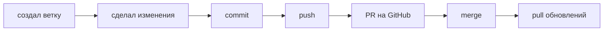

## 🚀 **Новый проект с нуля**

```bash
git init
git add .
git commit -m "Initial commit"
git branch -M main
git remote add origin https://github.com/user/repo.git
git push -u origin main
```

---

## 📊 **Повседневная работа**

```bash
git status                 # что изменилось?
git add file.txt           # добавить файл
git add .                  # добавить всё
git commit -m "message"    # закоммитить
git push                   # отправить
git pull                   # скачать обновления
```

---

## 🌿 **Ветки**

```bash
git branch                    # список веток
git switch -c feature/login   # создать и переключиться
git switch main               # переключиться на main
git branch -d feature/login   # удалить локально
git push origin --delete feature/login  # удалить на GitHub
```

> [!tip] Новый синтаксис
> `git switch` и `git restore` пришли на смену `git checkout`. Привыкай!

---

## 🔄 **PR-процесс (Pull Request)**

```bash
# 1. Создаём ветку
git switch -c feature/login

# 2. Делаем изменения
git add .
git commit -m "feat(login): добавить форму входа"

# 3. Пушим на GitHub
git push -u origin feature/login
```

> [!example] Что дальше?
> 4. Заходим на **GitHub**
> 5. Создаём **Pull Request** (кнопка "Compare & pull request")
> 6. Ждём ревью и **merge**

---

## 📜 **История**

```bash
git log                          # подробно
git log --oneline                # кратко
git log --oneline --graph        # визуально (рекомендую!)
```

---

## 🔙 **Отмена изменений**

| Команда | Что делает |
|---------|------------|
| `git reset file.txt` | убрать из staging (но сохранить изменения) |
| `git reset --soft HEAD~1` | отменить последний коммит (файлы остаются) |
| `git reset --hard HEAD~1` | отменить коммит **и удалить изменения** (❗️) |
| `git checkout -- file.txt` | откатить файл до последнего коммита |
| `git restore file.txt` | современная версия `checkout` |

> [!warning] Осторожно с `--hard`
> `git reset --hard` безвозвратно удаляет незакоммиченные изменения!

---

## 🔗 **Работа с удалённым репозиторием**

```bash
git remote -v        # посмотреть подключенные репозитории
git fetch            # скачать изменения без слияния
git pull             = git fetch + git merge
git push             # отправить изменения
```

---

## 🧠 **Главное понимание**

| Терминал | Git |
|----------|-----|
| управляет **системой** | управляет **историей кода** |
| файлы и папки | коммиты и ветки |
| `cd`, `ls`, `rm` | `commit`, `branch`, `merge` |

---

## 🔄 **Рабочий цикл разработчика**



Или в текстовом виде:

```
создал ветку → сделал изменения → commit → push → PR → merge → pull
```

---

## ⚡ **Самые частые команды (шпаргалка)**

```bash
# Старт дня
git switch main && git pull

# Новая фича
git switch -c feat/new-feature
# ... делаем изменения ...
git add . && git commit -m "feat: добавить фичу"
git push -u origin feat/new-feature
# → создаём PR на GitHub

# Закончили день
git switch main && git pull
```

---

## ✅ **Чек-лист перед push**

- [ ] `git status` — всё чисто?
- [ ] `git log --oneline` — последние коммиты выглядят логично?
- [ ] Тесты проходят?
- [ ] Код отформатирован?

> [!tip] Совет
> Делай коммиты часто и по смыслу. Один коммит = одно логическое изменение.

---

## 🚫 **Чего избегать**

❌ Коммитить всё подряд одним коммитом  
❌ Пушить в `main` напрямую (без PR)  
❌ Сообщения типа "fix", "update", "ы"  
❌ Игнорировать `.gitignore`

[[📝 GitHub Commits]]
